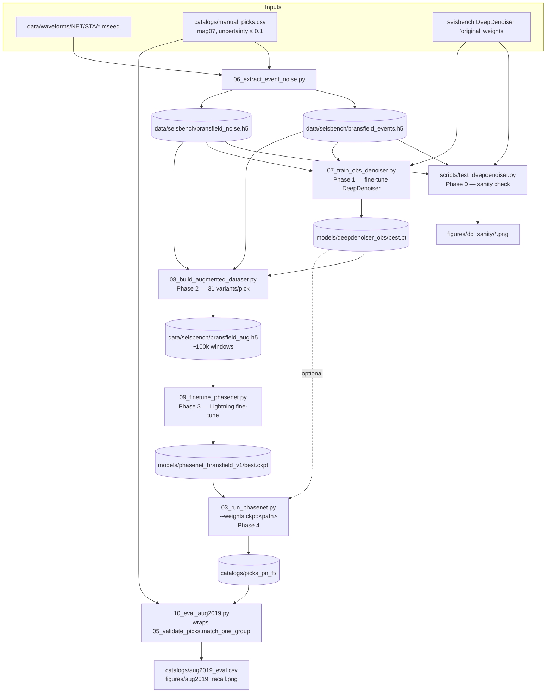

# Plan — OBS noise denoiser + PhaseNet fine-tuning

## Context

The 14-month BRAVOSEIS deployment is all the data we have. The goal is an
**expanded earthquake catalog** beyond what the manual analyst caught
(`nllmaleen_mag07_202210.out` — 12,099 picks across 1,126 events). The
baseline picker (PhaseNet `instance` + OBSTransformer @ 0.5) recovered only
P recall ≈ 0.42 / S recall ≈ 0.78 on Feb 4–13 — too many easy events are
slipping through. The fix is two-sided:

1. **Train a DeepDenoiser on BRAVOSEIS-OBS waveforms** — an STFT U-Net
   `seisbench.models.DeepDenoiser`, initialised from `original` weights and
   adapted to OBS noise.
2. **Fine-tune PhaseNet** on a curated set of 30 high-density days, using
   the trained denoiser to (a) generate noise-mixed training variants and
   (b) optionally provide a "cleaned" event channel.
3. **Honest evaluation** on a fully-held-out **August 2019** (1,144 picks
   over 26 active days, 106 events).

This plan refines the existing draft to align with the repo's actual
conventions (`catalogs/picks/<subdir>/`, `catalogs/manual_picks.csv`,
`--out-subdir`, the existing `match_one_group` matcher in
`scripts/05_validate_picks.py`) and removes references to files that the
draft assumed existed but don't (`scripts/06_*`, `scripts/07_*`,
`phasenet-retrain` clone).

## Data flow



## Phased plan

### Phase 0 — Sanity-check off-the-shelf DeepDenoiser (~15 min)

Verify whether `DeepDenoiser('original')` produces sensible output on OBS
waveforms, before committing to retraining.

**File:** `scripts/test_deepdenoiser.py` (NEW, throwaway)

- Load `sbm.DeepDenoiser.from_pretrained('original')`.
- Pull 3 mag07 event windows + 3 noise windows directly from
  `data/waveforms/...` using `mseed_path()` and the pick times from
  `catalogs/manual_picks.csv` (filter `source_file` contains `mag07`,
  `uncertainty_s ≤ 0.1`).
- Apply denoiser via `model.annotate(stream)` per docs, plot
  original/denoised/residual to `figures/dd_sanity/*.png`.

**Decision:** if denoised events look mangled (impulsive arrivals lost),
retraining is required (Phase 1 is mandatory). If reasonable, retraining is
still the plan but we have a cheap fallback.

### Phase 1 — Build OBS noise/event pools, train OBS-DeepDenoiser (~1 h GPU)

**File:** `scripts/06_extract_event_noise.py` (NEW)

Walk the 30 curated training days (see § *Training day list*) and the
station inventory:
- **Event windows:** for each mag07 pick with `uncertainty_s ≤ 0.1` on a
  curated day, cut a 30 s window around the pick from the matching
  `data/waveforms/<NET>/<STA>/*.mseed`. Reuse `_channel_match()` from
  `scripts/03_run_phasenet.py` for picking-channel selection. Target rate
  100 Hz (matches `--target-rate` default), 3-channel ZNE.
- **Noise windows:** for each curated station-day, sample candidate 30 s
  windows and gate them through three filters before keeping:
  1. **Manual-pick exclusion** — `>60 s` from any pick in *both*
     `nllmaleen_mag07_202210.out` and `nllmaleen_magall_202210.out`
     (`magall` ⊃ `mag07` and catches the lower-confidence events the draft's
     `mag07`-only filter would have missed).
  2. **STA/LTA detector reject** — run
     `obspy.signal.trigger.classic_sta_lta(tr, nsta=int(0.5*fs), nlta=int(10*fs))`
     on the candidate window's vertical channel and reject if any sample
     exceeds ratio 3.0. Catches events the analyst missed and non-tectonic
     transients (icequakes, whales, ships, T-phases) — exactly what the
     denoiser must treat as noise, not signal.
  3. **Amplitude sanity** — reject windows whose RMS is `<1e-3 ×` the
     station-day median RMS (dropouts/dead channels) or `>10 ×` median
     (clipping/spikes that aren't real noise).
  Target ~500 surviving windows per curated station-day. Plot the
  acceptance rate per station-day to `figures/noise_qc.png` so we can spot
  stations with pathological selection (e.g. 5 % acceptance → station has
  swarm activity outside mag07 catalog).
- Write SeisBench-format datasets:
  - `data/seisbench/bransfield_events.h5` + `metadata.csv`
  - `data/seisbench/bransfield_noise.h5` + `metadata.csv`

**File:** `scripts/07_train_obs_denoiser.py` (NEW)

DeepDenoiser is a *masking* STFT U-Net: given (signal + noise), it predicts
a TF mask isolating the signal. SeisBench's `STFTDenoiserLabeller` builds
the supervisory mask from clean signal + noise pairs.

```
- model = sbm.DeepDenoiser.from_pretrained('original')
- generator pipeline:
    pick random event window from bransfield_events
    pick random noise window from bransfield_noise
    mix at SNR ∈ [0.5, 10]
    STFTDenoiserLabeller -> mask
- Train: AdamW, lr 1e-4, batch 32, 50 epochs, MSE on mask
- 90/10 split by station (held-out stations validate generalisation,
  not just held-out windows of the same station)
- Save best by val_loss to models/deepdenoiser_obs/best.pt
```

**Verify:** plot 6 held-out windows pre/post denoising; `val_loss` curve
in `figures/dd_train_loss.png`.

### Phase 2 — Build noise-augmented PhaseNet training set (~30 min)

**File:** `scripts/08_build_augmented_dataset.py` (NEW)

For each of ~3,300 high-confidence picks across the 30 curated training days
(filter `source_file` contains `mag07` AND `uncertainty_s ≤ 0.1`):
- **30 noise variants:** mix the event window with random noise samples
  from `bransfield_noise.h5` at SNR ∈ [0.5, 10].
- **1 denoised variant:** apply the OBS-DeepDenoiser checkpoint from
  Phase 1.
- → ~31 × 3,300 ≈ ~100k SeisBench-format training windows in
  `data/seisbench/bransfield_aug.h5` + `metadata.csv`. Each row carries
  per-pick P/S sample indices for PhaseNet's `ProbabilisticLabeller`.

The dataloader in Phase 3 layers fresh online noise mixing + temporal
jitter + channel dropout on top each epoch — pre-materialising 31 variants
is for speed, online aug for variety.

### Phase 3 — Fine-tune PhaseNet (~1 h GPU)

**File:** `scripts/09_finetune_phasenet.py` (NEW)

We're **not** vendoring `phasenet-retrain` as separate copies — instead,
write a single self-contained Lightning script that uses SeisBench's own
training pipeline (`sbg.GenericGenerator`, `sbg.WaveformDataset`,
PhaseNet's built-in `forward` + cross-entropy on the 3-channel
target mask). This avoids importing a third-party package and patching
its `_load_custom_data()` `NotImplementedError` stub.

Skeleton:
```
- model = sbm.PhaseNet.from_pretrained('instance')   # transfer learning
- ds = sbd.WaveformDataset('data/seisbench/bransfield_aug')
- generator = sbg.GenericGenerator(ds)
  generator.add_augmentations([
      RandomWindow(samples=3001),
      ChangeDtype(np.float32),
      Normalize(detrend_axis=-1),
      ProbabilisticLabeller(label_columns=['P','S']),
      # online aug:
      OneOf([NoiseMix(p=0.5), GaussianNoise(p=0.3), Identity(p=0.2)]),
      ChannelDropout(p=0.1),
  ])
- Lightning Trainer: max_epochs 30, batch 64, lr 1e-4, AdamW
- Save best by val P+S F1 to models/phasenet_bransfield_v1/best.ckpt
```

**Config:** `configs/phasenet_finetune.yaml` (NEW) — pretrained tag,
data path, hyperparameters. Keep alongside `configs/targets.yaml`.

### Phase 4 — Held-out evaluation on August 2019 (~30 min)

**Edit:** `scripts/03_run_phasenet.py` — add `--weights ckpt:<path>` syntax
that loads via Lightning (`PhaseNet.load_from_checkpoint`) instead of
`from_pretrained`. Single small change in the worker init paths
(`_init_worker` and the serial branch); everything else stays the same.

**File:** `scripts/10_eval_aug2019.py` (NEW)

For all of August 2019, run four pickers and validate each by reusing
`load_manual_picks()` + `match_one_group()` from
`scripts/05_validate_picks.py`:

| ID | Picker | Output dir |
|---|---|---|
| A | PhaseNet `instance` @ 0.1 (baseline; may already exist) | `catalogs/picks/` |
| B | OBSTransformer `obst2024` @ 0.5 | `catalogs/picks_obst_05/` |
| C | PhaseNet **fine-tuned** @ 0.1 | `catalogs/picks_pn_ft/` |
| D | C on DeepDenoiser-cleaned input (optional) | `catalogs/picks_pn_ft_dd/` |

Filter manual to August 2019 + `uncertainty_s ≤ 0.1` + `source_file`
contains `mag07`. Aggregate per-day and global P/S recall, total pick
volume. Output:
- `catalogs/aug2019_eval.csv` (per picker × phase: TP/FP/FN, prec, recall)
- `figures/aug2019_recall.png` (per-day bar chart)

**Decision rule:**
- C > A on aggregate P recall on Aug 2019 → fine-tune helped.
- D > C → denoising at inference time also helps.
- Pick volume not collapsed (within ±20 % of baseline) → not just a
  precision tradeoff masquerading as recall gain.

### Phase 5 — Document & decide (~15 min)

- `notes/09_obs_denoiser_v1.md` — denoiser run, sample plots, decision.
- `notes/10_finetune_v1.md` — fine-tune run, August 2019 eval table.

If results clear the bar, deploy the fine-tuned PhaseNet on the full year
to build the expanded catalog. Otherwise, capture lessons; v2 ablation =
fine-tune **without** denoiser augmentation, to isolate whether denoiser
helped or hurt.

## Critical files

| File | Status | Change |
|---|---|---|
| `scripts/test_deepdenoiser.py` | NEW (throwaway) | Phase 0 sanity |
| `scripts/06_extract_event_noise.py` | NEW | Phase 1 — build event/noise SeisBench HDF5 pools |
| `scripts/07_train_obs_denoiser.py` | NEW | Phase 1 — fine-tune DeepDenoiser |
| `scripts/08_build_augmented_dataset.py` | NEW | Phase 2 — 31 variants/pick |
| `scripts/09_finetune_phasenet.py` | NEW | Phase 3 — Lightning fine-tune (no third-party fork) |
| `configs/phasenet_finetune.yaml` | NEW | Phase 3 config |
| `configs/finetune_train_days.csv` | NEW (committed) | The 30-day list below |
| `scripts/03_run_phasenet.py` | exists | Add `--weights ckpt:<path>` for Lightning checkpoints |
| `scripts/10_eval_aug2019.py` | NEW | Phase 4 — wraps `match_one_group` for the 4-picker comparison |
| `notes/09_obs_denoiser_v1.md` | NEW | Phase 5 — denoiser writeup |
| `notes/10_finetune_v1.md` | NEW | Phase 5 — fine-tune writeup |

**Reuses (do not rewrite):**
- `bransfield_eq.config.{REPO, daterange, mseed_path, pick_csv_path}`
- `_channel_match()` from `scripts/03_run_phasenet.py`
- `load_manual_picks()`, `match_one_group()` from `scripts/05_validate_picks.py`
- `bransfield_eq.manual_picks.write_normalized` (already produces
  `catalogs/manual_picks.csv` with `uncertainty_s`)

## 30-day training list (`configs/finetune_train_days.csv`)

mag07-confident days per non-August month, totaling 30 days. Counts after
`uncertainty_s ≤ 0.1`:

```
2019-01: 2019-01-17 (651), 2019-01-19 (110), 2019-01-18 (62)
2019-02: 2019-02-13 (233), 2019-02-05 (176), 2019-02-09 (136)
2019-03: 2019-03-12 (82),  2019-03-15 (60)
2019-04: 2019-04-04 (116), 2019-04-01 (104)
2019-05: 2019-05-13 (43),  2019-05-10 (33)
2019-06: 2019-06-09 (95),  2019-06-04 (54)
2019-07: 2019-07-08 (64),  2019-07-17 (53)
2019-09: 2019-09-18 (86),  2019-09-19 (77)
2019-10: 2019-10-04 (224), 2019-10-13 (197), 2019-10-31 (177)
2019-11: 2019-11-13 (54),  2019-11-29 (43)
2019-12: 2019-12-08 (86),  2019-12-28 (65)
2020-01: 2020-01-19 (111), 2020-01-25 (110), 2020-01-20 (98)
2020-02: 2020-02-07 (76),  2020-02-01 (61)
```
Total: 30 days, ~3,300 high-confidence picks across 13 non-August months.

## Held-out test set: August 2019

| Stat | Value |
|---|---:|
| Days with mag07 picks | 26 / 31 |
| Picks (`uncertainty_s ≤ 0.1`) | 1,144 (544 P + 600 S) |
| Events | 106 |

Mid-deployment, conditions similar to training, 3rd most active month after
Jan/Feb 2019 — enough sample for tight per-phase CIs, no swarm peculiarities,
disjoint from training days.

## Verification (end-to-end)

1. **Phase 0:** `figures/dd_sanity/*.png` — sensible event preservation +
   noise reduction (or visibly bad, in which case Phase 1 is mandatory).
2. **Phase 1:** `models/deepdenoiser_obs/best.pt` exists; train/val loss
   curve in `figures/dd_train_loss.png` shows monotonic val decrease;
   spot-check denoised plots cleaner than Phase 0.
3. **Phase 2:** `data/seisbench/bransfield_aug/metadata.csv` ≈ 100k rows;
   sample variants plotted look like the same event under varying noise.
4. **Phase 3:** Lightning logs `train_loss` + `val_loss` to TensorBoard;
   val loss decreases; `models/phasenet_bransfield_v1/best.ckpt` saved.
4b. **Noise QC:** `figures/noise_qc.png` shows per-station-day acceptance
   rates after STA/LTA + magall + amplitude filters; stations <20 % accept
   are flagged for inspection (likely contain unmarked swarms).
5. **Phase 4:** `catalogs/picks_pn_ft/` populated for August 2019;
   `catalogs/aug2019_eval.csv` shows fine-tuned recall vs baseline;
   `figures/aug2019_recall.png` per-day bar chart.

## Estimated wall-clock

| Phase | Time |
|---|---|
| 0. Sanity check | ~15 min |
| 1. Extract pools + train OBS-DeepDenoiser | ~1.5 h (extract 30 min, train 1 h GPU) |
| 2. Build augmented dataset (~100k variants) | ~30 min |
| 3. Fine-tune PhaseNet (Lightning, 30 epochs) | ~1 h GPU |
| 4. August 2019 evaluation (4 pickers) + plots | ~30 min |
| 5. Notes | ~15 min |
| **Total** | **~4 h** |

Year download still progressing (~22/37 stations); doesn't block — the 21
complete OBS stations already cover ≈99 % of mag07 picks.

## What this plan deliberately does NOT do

- **No association/location.** Picker recall on held-out August is the proxy
  for "expanded catalog"; PyOcto/NLLoc adds days of work — separate stage.
- **No PhaseNet hyperparameter sweep.** Single LR/batch/loss. v2 if v1
  underperforms.
- **No DeepDenoiser hyperparameter sweep.** Single architecture, single LR.
- **Doesn't fine-tune OBSTransformer** — only PhaseNet (the off-the-shelf
  picker that's worse).
- **Doesn't fine-tune from PickBlue** — start from `instance` (best P
  recall on the day-26 baseline).
- **Doesn't vendor `phasenet-retrain`.** The Lightning script in
  `scripts/09_finetune_phasenet.py` uses SeisBench's own training stack
  directly, avoiding the third-party `_load_custom_data()`
  `NotImplementedError` stub that the draft proposed patching.
- **Approach D (denoiser encoder as PhaseNet pretraining) deferred** as a
  multi-day v2 research project.