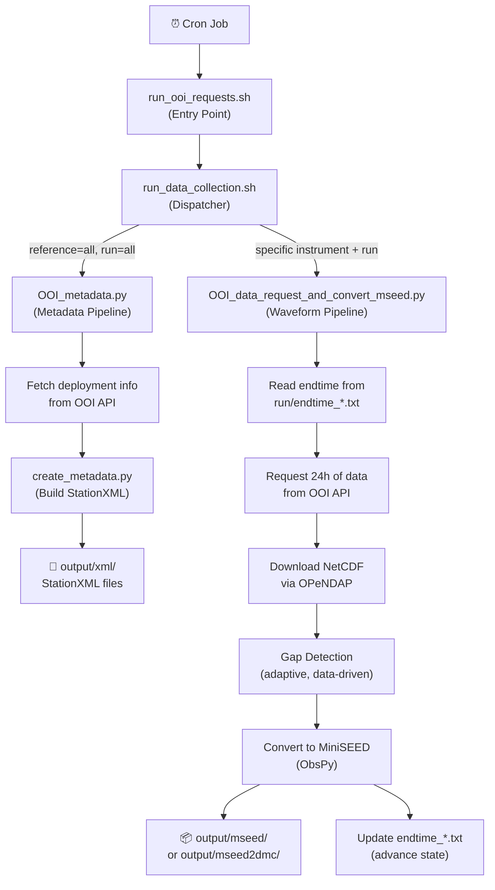

**This is an automated ETL pipeline that pulls seafloor sensor data from the OOI (Ocean Observatories Initiative) and converts it into seismology-standard formats for archival at EarthScope.**

Specifically:

- **Runs via cron** every day, processing **24-hour windows** of data
- **Pulls data** from 3 cabled seafloor pressure/temperature sensors (PREST) off the Pacific Northwest coast via the OOI API (returns NetCDF)
- **Detects data gaps** using an adaptive algorithm based on actual timestamps (not nominal sample rates) — see [[gap detection]]
- **Converts to MiniSEED** files (the standard format for seismic waveform data) using ObsPy
- **Generates StationXML** metadata for the stations
- **Stages output** for delivery to EarthScope via either SeedLink (real-time) or miniseed2dmc (historical backfill)
- **Tracks state** by saving the last processed timestamp in `run/endtime_*.txt`, so each run picks up where the previous one left off
- **Sends email alerts** for failures, missing data, sample rate anomalies, and approaching deployment end dates

This is an **automated data pipeline** that pulls ocean-floor geophysical sensor data from the [Ocean Observatories Initiative (OOI)](https://oceanobservatories.org/) and converts it into **seismology-standard formats** (MiniSEED and StationXML) for archival at EarthScope (formerly IRIS).

The sensors are **cabled seafloor pressure instruments (PREST)** deployed on the Juan de Fuca plate off the US Pacific Northwest coast, sampling at **≤8 Hz** ("Tier-3" data). A broader non-Tier-1 channel/station inventory is at [[non_tier1_ooi_instrument_data_notes]].

---

## Pipeline Flow

---

## Key Components

### 1. Shell Wrappers (`bin/`)

| Script | Role |
|--------|------|
| [run_ooi_requests.sh](file:///Users/quakehunter/Documents/COSZO/coszo-data-collection/bin/run_ooi_requests.sh) | **Entry point.** Activates conda env, loads OOI API credentials from `.ooi_env`, launches the dispatcher. |
| [run_data_collection.sh](file:///Users/quakehunter/Documents/COSZO/coszo-data-collection/bin/run_data_collection.sh) | **Dispatcher.** Parses args (instrument reference, run name, transfer method), prevents duplicate processes, routes to either the metadata or waveform Python script. |

### 2. Waveform Pipeline — [OOI_data_request_and_convert_mseed.py](file:///Users/quakehunter/Documents/COSZO/coszo-data-collection/bin/OOI_data_request_and_convert_mseed.py)

This is the **core of the system** (~840 lines). For each execution it:

1. **Reads state** — Picks up where it left off by reading the last processed timestamp from `run/endtime_*.txt`
2. **Requests 24h of data** — Calls the OOI M2M API for one day's worth of sensor data (NetCDF format)
3. **Polls for completion** — The OOI API is async; it polls `status.json` up to 5 times with 50s delays
4. **Opens the NetCDF** — Reads it via OPeNDAP (remote) or optionally downloads a local copy
5. **Detects gaps** — Uses a robust, adaptive algorithm:
   - Estimates the real sample period from the median Δt (ignoring nominal/configured rates)
   - Compares actual vs. expected point counts
   - Uses adaptive thresholds (higher multiplier for long-period sensors, lower for short-period)
   - Splits data into contiguous segments at detected gaps
6. **Converts to MiniSEED** — For each channel (pressure, temperature) and each contiguous segment:
   - Builds ObsPy `Trace` objects with proper SEED header (network, station, location, channel)
   - Applies unit conversion
   - Writes `.mseed` files
7. **Advances state** — Updates `endtime_*.txt` so the next run picks up exactly where this one stopped
8. **Alerts** — Sends email notifications for failures, missing data, sample rate deviations, and approaching deployment end dates

### 3. Metadata Pipeline — [OOI_metadata.py](file:///Users/quakehunter/Documents/COSZO/coszo-data-collection/bin/OOI_metadata.py)

- Queries the OOI API for deployment info (lat, lon, depth, calibration, UIDs)
- Calls [create_metadata.py](file:///Users/quakehunter/Documents/COSZO/coszo-data-collection/bin/create_metadata.py) to build **StationXML** files (the standard for seismic station metadata)
- Outputs to `output/xml/`

### 4. Configuration (`param/`)

| File | Purpose |
|------|---------|
| `run_prest.txt` | Global run parameters: API URLs, time interval (86400s = 24h), polling settings, record length, gap detection, alert thresholds |
| `RS01SUM1_LJ01B_09_PRESTB102.txt` | Per-instrument params: network code, station code, channel list, data types |
| `*_LDO_10.txt`, `*_LK1_10.txt`, etc. | Per-channel params: SEED channel code, location code, sample rate, unit conversion factor, calibration dates |

### 5. State Tracking (`run/`)

- `endtime_*.txt` files store the **last processed timestamp** for each instrument+transfer_method combination
- This is how the pipeline "remembers" where it left off between cron runs

---

## Two Transfer Methods

| Method | Use Case | Output Directory |
|--------|----------|-----------------|
| **seedlink** | Near-real-time streaming to EarthScope | `output/mseed/` |
| **miniseed2dmc** | Historical backfill of older data | `output/mseed2dmc/<YEAR>/` |

---

## Instruments Covered

The pipeline currently handles **3 seafloor pressure sensors** (PREST = Pressure Sensor):

| Reference Designator | Location |
|----------------------|----------|
| RS01SLBS-MJ01A-06-PRESTA101 | Slope Base |
| RS01SUM1-LJ01B-09-PRESTB102 | Southern Hydrate Ridge |
| RS03AXBS-MJ03A-06-PRESTA301 | Axial Base |

Each has multiple channels: **LDO** (pressure), **LK1** (temperature), **UDO** (pressure), **UK1** (temperature) — in both "L" (low-gain) and "U" (ultra-low) variants.

---

## Summary

> **In one sentence:** This code automatically pulls seafloor pressure/temperature data from the OOI API every 24 hours, detects gaps, converts it to seismology-standard MiniSEED files, and stages them for delivery to EarthScope — functioning as a reliable, cron-driven ETL pipeline for ocean-bottom geophysical data.
